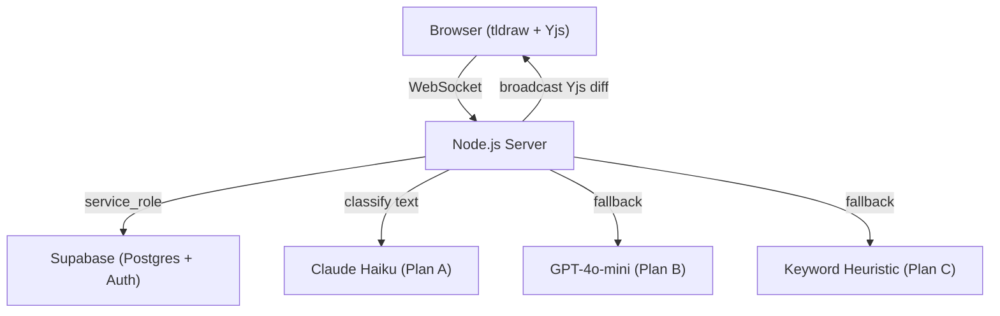

# LIGMA — Live Interactive Group Meeting Assistant

Real-time collaborative whiteboard with AI-powered intent classification, RBAC, and append-only audit logging.

## Overview

LIGMA is a collaborative canvas built on tldraw + Yjs CRDT sync. Every shape mutation is classified by AI (Claude Haiku → GPT-4o-mini → heuristic fallback) to extract action items and decisions automatically. Role-based access control enforces who can edit, lock, and manage nodes.

## Local Setup

```bash
# 1. Clone and enter the repo
git clone <repo>
cd <repo>

# 2. Install client deps
cd client && npm install

# 3. Install server deps
cd ../server && npm install

# 4. Configure environment
cp client/.env.example client/.env      # fill in Supabase URL + anon key + server URL
cp server/.env.example server/.env      # fill in Supabase service key + LLM keys

# 5. Apply schema
# Paste schema.sql into Supabase SQL editor and run it

# 6. Run both in separate terminals
cd client && npm run dev     # http://localhost:5173
cd server && npm run dev     # http://localhost:3000
```

## Architecture



## Architecture Decisions

### Why Not @tldraw/sync?

We use a custom Yjs-over-WebSocket protocol instead of `@tldraw/sync` / `TLSocketRoom` because:

- **RBAC enforcement**: Every mutation must be validated against `node_acl` and `room_members` before being applied. `TLSocketRoom` is opaque — it exposes no per-mutation hooks.
- **Audit logging**: Every mutation writes an immutable row to `events` via Postgres RULES. There is no injection point in `TLSocketRoom` for this.
- **AI classification**: Text content must be extracted from each mutation to call the LLM classifier. Again, no hook in `TLSocketRoom`.

The custom protocol: client encodes tldraw store changes as `Y.Doc` updates, sends them as `mutation:apply` over WebSocket, server validates → applies → logs → broadcasts.

### AI Strategy — LLM-First with Graceful Degradation

The hackathon permits paid API calls via free credits. We maximize classification accuracy with a three-tier fallback:

| Plan | Provider | Trigger |
|------|----------|---------|
| A | Anthropic Claude Haiku (~800ms) | Primary |
| B | OpenAI GPT-4o-mini | Anthropic 429/error |
| C | Keyword heuristic | Both APIs fail, or user rate-limited |

All results cached by SHA-256 text hash. 10 LLM calls per user per minute (token bucket).

### Event Sourcing

`events` and `yjs_snapshots` are **separate systems**:
- `yjs_snapshots`: binary Yjs state vector, used for cold-join sync
- `events`: semantic audit log of what happened and when — not replayable into Yjs

Postgres `RULES` (`no_update_events`, `no_delete_events`) enforce immutability at the DB engine level. Application code — including service_role — cannot UPDATE or DELETE event rows through normal SQL. Only a Postgres superuser (Supabase SQL editor admin) can bypass RULES, which is acceptable for a demo environment.

### RBAC Fallback

If a node has no `node_acl` row, the fallback required role is `'contributor'`. This rule **only applies to authenticated members**. Non-members are hard-rejected regardless of any ACL configuration.

Role hierarchy: `lead (3) > contributor (2) > viewer (1)`.

### Contested Node Detection

CRDT solves the **technical** conflict (both edits are merged). Contested Node solves the **human** conflict (two people disagree on what a node should say).

Detection: if ≥2 distinct users each edit the same node ≥4 times within 60 seconds, a contest is raised. The `versions` stored are **pre-merge text snapshots** from each user's WS payload — not unmerged CRDT state.

Resolution: members vote; lead can lock as decision (freezes node for everyone, including lead).

## Known Limitations

- **5s data-loss window**: snapshot writes are debounced 5s. Ungraceful crash (kill -9) loses up to 5s of mutations. SIGTERM flushes all rooms.
- **Single Render instance**: Y.Doc lives in-memory. Horizontal scaling requires a shared Yjs provider (e.g., y-redis), not implemented.
- **Client-supplied textSnapshot**: The text sent for AI classification comes from the client WS payload, not parsed from the Yjs update server-side. A compromised client could send misleading text. Production would parse Yjs server-side.
- **yjsUpdate as number[]**: Yjs binary is JSON-serialized as a number array, ~33% larger than raw bytes. MessagePack or base64 would be more efficient.
- **In-memory rate limiter**: resets on server restart.
- **TRUNCATE bypasses RULES**: Postgres superuser can TRUNCATE events. RULES only block UPDATE/DELETE at the statement level.
- **Permission denial log**: 10s per-(user,node) dedup limits growth but doesn't bound total size.

## Security

```bash
# Must return zero results before deploy
grep -rE "\.from\(['\"](rooms|room_members|events|tasks|node_acl|contested_nodes|yjs_snapshots)['\"]\)\.(insert|update|delete|upsert)" client/src/
grep -r "SUPABASE_SERVICE_KEY" client/src/
grep -r "ANTHROPIC_API_KEY" client/src/
grep -r "OPENAI_API_KEY" client/src/
```
